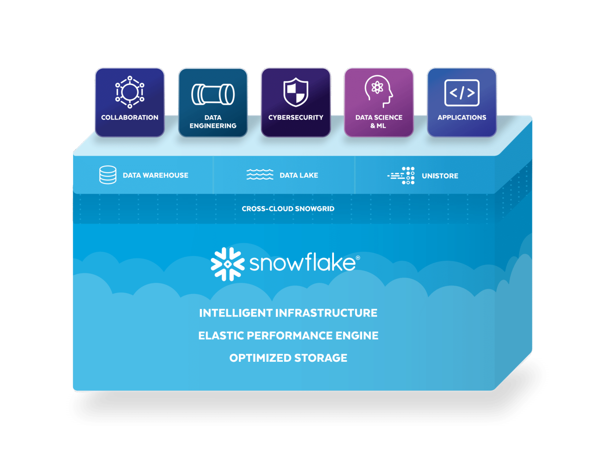

# Data Pipeline on Snowflake
### Tutorial of an ETL pipeline on snowflake

Building a data pipeline on snowflake warehouse 

The idea will be that data will be uploaded into S3 or a datalake, then AWS SQS will queue the data to a snowpipe in snowflake

Snowflake is divided into three zones:
          landing zone;
          curated zone;
          consumption zone.
The data will first arrive on the landing zone, move towards the curated zone and finalize the process on the consumption zone where the dynamic schemas reside.

